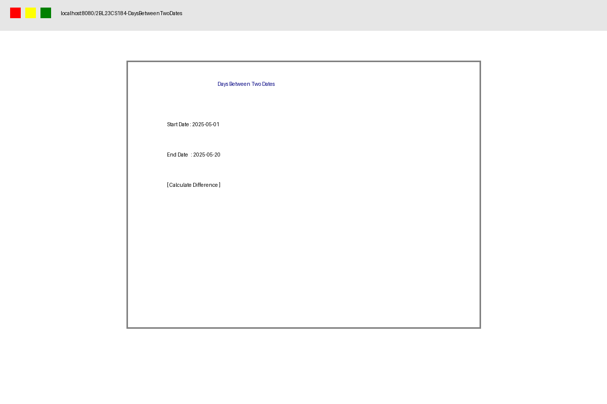
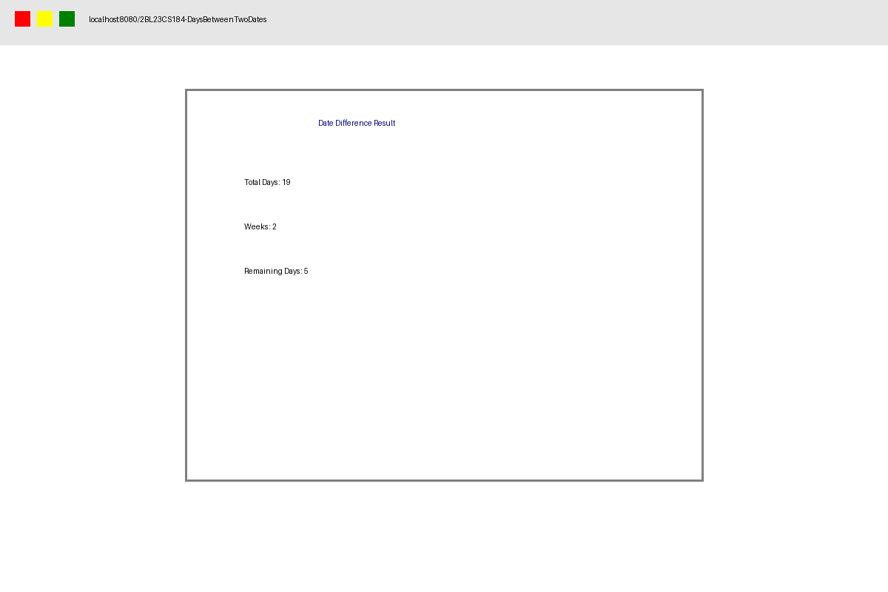
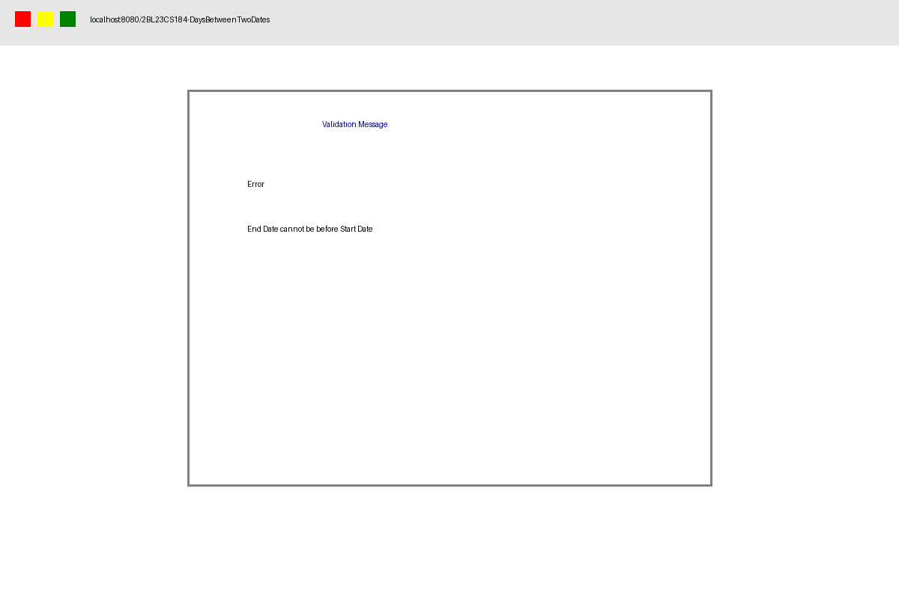

# Days Between Two Dates

## Student Details

| Field | Details |
|---------------|----------------------------------|
| Name | Vijaylaxmi Koppad |
| USN | 2BL23CS184 |
| Branch | Computer Science And Engineering |
| Semester | VI Semester |
| Subject | Advanced Java Programming |
| Problem No. | Problem 58 |

## Problem Statement

This project calculates the number of days between two dates using Java Servlets.

## Technologies Used

- Java Servlets
- HTML & CSS
- Apache Tomcat 10
- Eclipse IDE

## Screenshots

### Input Form

### Output Page

### Validation Message

## Servlet Concept Practiced

doPost and Request Parameter Handling
